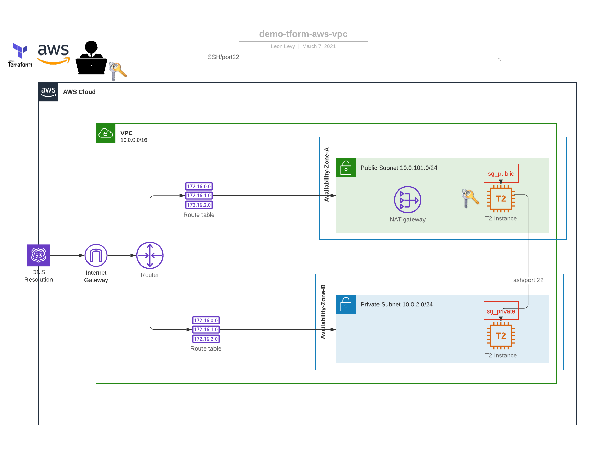

# AWS VPC Creation with Terraform
This project will create a VCP with Internet Gateway, subnets accross 2 AZs: one public
and one one private.

From there terraform will deploy a bastion host in the public subnet in AZ1 and a second host
in the private subnet in AZ2, which can connect to the internet via a NAT gateway created
as part of the VPC.

An SSH key pair is dynamically generated as well, and the private key is copied over to the
bastion host.

The ec2 instance in the public subnet is assigned a security group with access from the 
the intenret via port 22 (for ssh).

The ec2 instance in the private subnet is assigned to a security group that only allows
ssh access only from connections in the public subnet.

Both security groups are dynamically created in the network module.

## High level diagram

## Current state

Modules:

- ssh-key: Generates an ssh key pair
- network: Sets up a VPC with IGWs, NAT GWs, 2 public subnets, 2 private subnets, SG to SSH in from anywhere
- ec2: Currently creates a bastian ec2 instance in a public subnet and a ec2 instance in a private subnet
- each subnet is in a different AZ
- private key is copied over to the bastion ec2 instance so it can ssh into the private subnet
- ec2 in private subnet has outgoing network access though the NAT gateway
- may add ansible playbook to take care of copying over the shh key to the bastian ec2## Requirements

No requirements.

## Providers

No provider.

## Inputs

| Name | Description | Type | Default | Required |
|------|-------------|------|---------|:--------:|
| namespace | The project namespace to use for unique resource naming | `string` | `"LL-TEST"` | no |
| region | AWS region | `string` | `"us-east-1"` | no |

## Outputs

| Name | Description |
|------|-------------|
| private\_connection\_string | Copy/Paste/Enter - You are in the private ec2 instance |
| public\_connection\_string | Copy/Paste/Enter - You are in the matrix |

